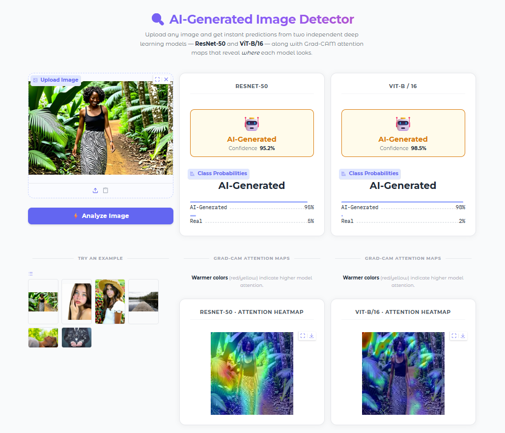

# DS5500 - Detecting AI-Generated Images

**Team 2 | Northeastern University DS5500 Data Capstone | Spring 2026**

**Team Members:** Xin Wang, Jiajun Fang

> **Demo:** Upload an image and get a real-time AI vs. Real verdict with Grad-CAM heatmaps from both ResNet-50 and ViT-B/16.  
> Run locally with `python demo/app.py` (see [How to Run §7](#7-gradio-demo)).



---

## Quick Start

```bash
pip install -r requirements.txt                              # install dependencies
pytest -q                                                     # run test suite (72 tests, 66 pass / 6 skip without gradio)
python -m training.train --config configs/smoke_test.yaml     # smoke test (CPU, ~2 min)
python demo/app.py                                            # launch Gradio demo
```

---

## Problem Statement and Objectives

Generative AI models can now produce photorealistic images that are difficult to
distinguish from photographs taken by humans.  This project builds a binary image
classifier to detect whether a given image is **AI-generated (label 1)** or
**human/real (label 0)**.

Objectives:
- Benchmark transfer-learning with linear probing (frozen backbone)
- Compare CNN-based (ResNet-50) and transformer-based (ViT-B/16) architectures
- Establish a reproducible training and evaluation pipeline

---

## Results (5 k-sample baseline)

| Model      | Test Accuracy | Test ROC AUC | Epochs (early stop) | Training hardware |
|------------|--------------|--------------|---------------------|-------------------|
| ResNet-50  | 90.20 %      | 0.9662       | 20                  | Google Colab T4   |
| ViT-B/16   | 85.90 %      | 0.9294       | 11                  | HPC cluster (V100-SXM2) |

Both runs use a frozen backbone (linear probe).  The codebase supports
selective backbone unfreezing via `unfreeze_last_n_blocks` for possible
future fine-tuning experiments, but this has not been tested yet.

> **Reproducibility:** random seed is fixed at `42` in all configs and cuDNN
> deterministic mode is enabled (`deterministic=True`, `benchmark=False`).
> Re-running the same config on the same machine with the pre-committed split
> CSVs in `data/splits/` should produce results very close to those reported
> above. Bit-identical reproduction is not guaranteed because PyTorch's
> multi-process DataLoader workers and certain GPU operations retain
> non-deterministic behaviour even with a fixed seed.

### Repository Artifacts

| Artifact | Included in Repo | How to Obtain |
|----------|:---:|---|
| Config YAML files (`configs/`) | Yes | — |
| Pre-computed split CSVs (`data/splits/`) | Yes | — |
| Trained checkpoint: ViT-B/16 (`checkpoints/vit_b16/`) | No | 327 MB — too large for GitHub; request from team or retrain with `configs/vit_b16.yaml` |
| Trained checkpoint: ResNet-50 (`checkpoints/resnet50/`) | No | 90 MB — request from team or retrain with `configs/resnet50.yaml` |
| Training history CSV (`outputs/vit_outputs/`) | No | Generated during training; retrain to reproduce |
| Image dataset (`data/sampled_data_5k/`) | No | See `data/README.md` for download and sampling instructions |
| Python environment | No | `pip install -r requirements.txt` |

> **Note:** `checkpoints/` is listed in `.gitignore` and is not tracked by Git. If you see checkpoint files locally, they were generated by a prior training run.

---

## Project Structure

```
DS5500-Detecting_AI_Generated_Images/
├── configs/                        # YAML hyperparameter configs
│   ├── resnet50.yaml
│   ├── vit_b16.yaml
│   └── smoke_test.yaml             # CPU / quick sanity-check config
│
├── data/                           # Dataset, transforms, splits (see data/README.md)
│   ├── dataset.py                  # AIDataset, transforms, split logic, DataLoader factory
│   └── splits/                     # Pre-computed train/val/test split CSVs
│       ├── df_train.csv
│       ├── df_val.csv
│       └── df_test.csv
│
├── demo/                           # Gradio web demo (see demo/README.md)
│   └── app.py                      # ResNet-50 + ViT + Grad-CAM
│
├── models/                         # Model builders (see models/README.md)
│   ├── resnet.py                   # ResNet-50 builder
│   ├── vit.py                      # ViT-B/16 builder
│   └── model_factory.py            # build_model() dispatcher
│
├── training/                       # Training loop and config (see training/README.md)
│   ├── train.py                    # CLI entry-point
│   └── trainer.py                  # Trainer class (fit / evaluate)
│
├── visualization/                  # Grad-CAM and training-curve tools (see visualization/README.md)
│   ├── visualize.py                # Confusion matrix, ROC curve, training curve plots
│   └── gradcam.py                  # Grad-CAM overlays for ResNet-50 and ViT-B/16
│
├── notebooks/                      # Exploratory notebooks
│   ├── AIGI-Detection-ResNet50.ipynb
│   ├── AIGI-Detection_ViT.ipynb
│   └── GradCAM_workflow.ipynb
│
├── slurm/                          # HPC job scripts (see slurm/README.md)
│   ├── train_resnet50.slurm
│   ├── train_vit_b16.slurm
│   ├── submit_all.sh
│   └── README.md
│
├── tests/                          # pytest test suite (see tests/README.md)
│
├── Final_Milestone_Report_Team_2.pdf
├── requirements.txt
└── .gitignore
```

> **Note:** The following folders are gitignored and must be created locally before training.

```
data/sampled_data_5k/   # 5k-image working subset (download from Kaggle)
│   ├── train/          # 3,000 images
│   ├── validation/     # 1,000 images
│   └── test/           # 1,000 images
│
checkpoints/            # Created automatically during training
outputs/                # Created automatically during training
```

For HPC cluster artifact paths and the `aigi_runs/` layout, see [slurm/README.md](slurm/README.md).

---

## Dataset

- **Source:** Kaggle - [AI vs. Human-Generated Images](https://www.kaggle.com/datasets/alessandrasala79/ai-vs-human-generated-dataset)
- **Size:** 79,950 labelled images (`train_data/`)
- **Balance:** 50 % AI-generated / 50 % human
- **Schema:** `file_name`, `label` (1 = AI, 0 = human)
- **Working subset:** 5,000 images sampled (3,000 train / 1,000 val / 1,000 test), stored in `data/sampled_data_5k/`

The original test set (`test_data_v2`) has no labels and is not used.

---

## Methods Overview

| Stage | Approach |
|-------|----------|
| Pre-processing | Resize → RandomCrop/CenterCrop → ColorJitter (train only) → ImageNet normalization |
| Models | ResNet-50 and ViT-B/16, both pre-trained on ImageNet |
| Training strategy | Frozen backbone (linear probe) |
| Loss | Cross-entropy with label smoothing (0.1) |
| Optimizer | AdamW with cosine annealing LR |
| Regularization | Gradient clipping, early stopping (patience = 5), AMP |

We picked ResNet-50 as the CNN baseline because it's a well-understood architecture with a strong track record on transfer learning tasks, and its 2,048-dim feature vector keeps the linear-probe head small and fast to train — practical for a T4 GPU with a 5k-image subset. ViT-B/16 was chosen as the transformer counterpart: where ResNet captures local texture patterns through convolutions, ViT processes the image as a sequence of 16×16 patches, so the two architectures likely pick up on different visual cues for detecting AI-generated content. We deliberately kept both models in linear-probe mode (frozen backbone) rather than full fine-tuning, because 5,000 training samples is too small to fine-tune 86M+ parameters without severe overfitting. Larger models such as ViT-L or CLIP were not explored in this project due to time constraints.

The dataset is divided into a stratified 60/20/20 hold-out split (3,000 train / 1,000 val / 1,000 test), with class balance preserved across all three sets. The pre-computed split CSVs in `data/splits/` are committed to the repo so every run evaluates on the exact same partitions. Training monitors validation loss and ROC-AUC at the end of each epoch; if **validation loss** does not improve for 5 consecutive epochs, training stops early and the best checkpoint is loaded during evaluation. We chose hold-out over k-fold cross-validation for two reasons. First, even in linear-probe mode each epoch requires a full forward pass through the frozen backbone for every image, so k training runs would multiply GPU time non-trivially given GPU quota constraints. Second, because the linear-probe head has very few tunable parameters (a single linear layer on top of a frozen backbone), the risk of overfitting on the validation estimate is low and the variance reduction that k-fold provides is not worth the additional compute cost.

---

## How to Run

> **Environment note:**  
> - **Local**: `training/` scripts run against the pre-sampled 5,000-image subset in `data/sampled_data_5k/`.  
> - **HPC cluster**: SLURM scripts in `slurm/` handle environment setup, scratch-storage paths, and logging automatically.  
> - **Google Colab**: notebooks in `notebooks/` use the full 79,950-image dataset with a GPU runtime.

### 1. Install dependencies

```bash
pip install -r requirements.txt
```

> **Tested on:** Python 3.12 · PyTorch 2.2.2 · torchvision 0.17.2 · CPU-only (local) and CUDA 11.8 (Google Colab T4 / HPC V100).  
> Other patch-level versions of PyTorch 2.x should work but have not been verified.

### 2. Smoke test (CPU, no GPU required)

To verify the full pipeline runs without errors on a CPU machine:

```bash
python -m training.train --config configs/smoke_test.yaml
```

This runs 2 epochs with `batch_size=8`, `use_amp=false`, and `num_workers=0` — finishes in a few minutes on CPU.

### 3. Local training (pre-sampled data in `data/sampled_data_5k/`)

Split CSVs are already present in `data/splits/`.  Run directly from the repo root:

```bash
python -m training.train --config configs/vit_b16.yaml
```

### 4. HPC / Cluster training

```bash
cd /home/$USER/DS5500_Data_Capstone/DS5500-Detecting_AI_Generated_Images
sbatch slurm/train_vit_b16.slurm
```

See [slurm/README.md](slurm/README.md) for interactive `srun` sessions, hyperparameter overrides, grid search, and artifact paths.

### 5. Google Colab — notebooks or full-dataset training

Open a notebook from `notebooks/` directly in Colab, or run the CLI with the full dataset by mounting Google Drive and passing paths as CLI flags:

```bash
python -m training.train \
    --config    configs/resnet50.yaml \
    --data_root /content/train_data \
    --csv_path  /content/drive/MyDrive/.../train.csv \
    --save_dir  /content/drive/MyDrive/checkpoints/resnet50
```

### 6. Grad-CAM visualization

Checkpoints are loaded from their default paths in `checkpoints/`.

```bash
# Single image — both models (interactive)
python visualization/gradcam.py --image data/sampled_data_5k/test/some_image.jpg --model both

# Save figures to disk
python visualization/gradcam.py --image data/sampled_data_5k/test/some_image.jpg \
    --model resnet50 --save-dir outputs/gradcam/
```

See [visualization/README.md](visualization/README.md) for all flags and usage patterns.

---

### 7. Gradio Demo

A one-click local web app that runs both models and shows Grad-CAM heatmaps alongside the verdict.

**Prerequisites**

1. Install dependencies (includes `gradio` and `grad-cam`):
   ```bash
   pip install -r requirements.txt
   ```
2. Both model checkpoints must be present at their default paths:
   ```
   checkpoints/resnet50/best_model_resnet50.pth
   checkpoints/vit_b16/best_model_20260317_220741.pth
   ```
   If you trained locally, they are created automatically.  
   To use downloaded HPC artifacts, copy the `.pth` files into the paths above.

**Launch**

```bash
# from the project root
python demo/app.py
```

Gradio prints a local URL, e.g.:

```
Running on local URL:  http://127.0.0.1:7862
```

Open that URL in any browser, upload an image (JPG / PNG), and the app will display:

- **Binary verdict + confidence score** from both ResNet-50 and ViT-B/16
- **Grad-CAM heatmaps** showing which regions each model used to make its decision

Example images from `data/sampled_data_5k/test/` are loaded automatically as quick-start examples (if the folder exists).

> **CPU-only machines:** Inference is slower but fully supported — no GPU required.

---

## Supported Models

| Config key        | Architecture    | Source         |
|-------------------|-----------------|----------------|
| `resnet50`        | ResNet-50       | torchvision    |
| `vit_b_16`        | ViT-B/16        | torchvision    |

Add new models by registering them in `models/model_factory.py`.

---


## Assumptions and Limitations

- **Dataset size:** Experiments use a 5,000-image sample (~6 % of the full dataset).  Results may not generalise to the full distribution.
- **Class balance:** The 50/50 split is preserved in all sub-samples; results assume balanced evaluation.
- **Hardware difference:** ResNet-50 was trained on Google Colab (Tesla T4); ViT-B/16 was trained on the Northeastern Discovery HPC cluster (V100-SXM2).  Direct timing comparisons are not meaningful.
- **Backbone frozen:** Both models are evaluated in linear-probe mode only; full fine-tuning has not yet been tested.
- **No augmentation at inference:** Validation and test splits use deterministic center-crop transforms only.

---

## Team Contributions

| Member | Responsibilities |
|--------|------------------|
| Xin Wang | ViT-B/16 experiments, tests, Gradio demo, README, repo structure |
| Jiajun Fang | Training pipeline, ResNet-50 baseline, Grad-CAM analysis, notebooks, result interpretation |

---


